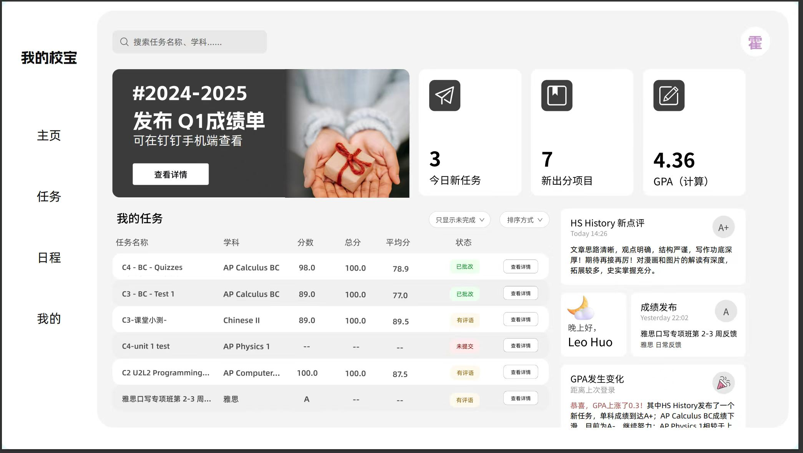

# My Xiaobao 📚✨

My Xiaobao is a front-end implementation of a task management platform for Tsinglan School (清澜山学校). It improves upon the previous platform by enhancing usability, aesthetics, and incorporating a GPA calculator. The aim is to provide students with a more user-friendly experience for managing their academic tasks and performance.

## 🚀 Features

- **Task Management 📝**: Easily view and manage all your tasks, categorized by subject and status.
- **GPA Calculation 📊**: Automatic GPA calculation based on completed tasks and grades.
- **Progress Tracking 📈**: Track your academic progress through updated scores and real-time GPA changes.
- **Personalized Feedback 💬**: Receive feedback on each task with comments and performance evaluation.
- **Dashboard Overview 📅**: At a glance, see your upcoming tasks, newly assigned projects, and current GPA.
- **Multi-Language Support 🌍**: Built-in support for both English and Chinese.

## 🎨 Design


_A snapshot of the current design of the My Xiaobao platform._

*(Please replace the placeholder above with the actual design image.)*

## 📝 To-Do List

- [ ] Implement User Authentication and Login Screen 🔐
- [ ] Develop Task Management Interface with Sorting and Filtering Options 📋
- [ ] Integrate GPA Calculation Module 🎓
- [ ] Implement Notifications for New Tasks and Updates 🔔
- [ ] Add Feedback and Evaluation Module for each Task 💡
- [ ] Build User Profile Section for Personalized Settings 👤
- [ ] Responsive Design for Mobile Devices 📱
- [ ] Localization for English and Chinese Languages 🌐
- [ ] Dark Mode Theme for Better User Experience 🌙

## 🤝 Contributing

Thank you for considering contributing to My Xiaobao! Please follow these guidelines to get started:

1. **Fork the Repository**: Click the "Fork" button on the top right to create your own copy of the repository.
2. **Clone Your Fork**: Use `git clone` to clone your forked repository to your local machine.
   ```bash
   git clone <Our-Project>
   ```
3. **Create a New Branch**: Create a new branch for your feature or bugfix.
   ```bash
   git checkout -b feature/your-feature-name
   ```
4. **Commit Your Changes**: Make your changes and commit them with a descriptive message.
   ```bash
   git commit -m "Add your message here"
   ```
5. **Push to Your Branch**: Push your changes to your forked repository.
   ```bash
   git push origin feature/your-feature-name
   ```
6. **Create a Pull Request**: Go to the original repository and create a new pull request. Make sure to describe your changes thoroughly.

## 📄 License

This project is licensed under the MIT License.
